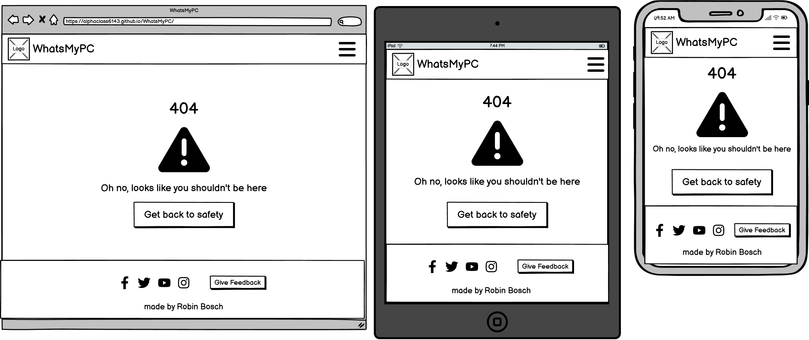

# WhatsMyPC

(Developer: Robin Bosch)

[Live webpage](https://alphaclass6143.github.io/WhatsMyPC/)

## Table of Content

1. [Project Goals](#project-goals)
    1. [User Goals](#user-goals)
    2. [Site Owner Goals](#site-owner-goals)
2. [User Experience](#user-experience)
    1. [Target Audience](#target-audience)
    2. [User Requirements and Expectations](#user-requirements-and-expectations)
    3. [User Stories](#user-stories)
3. [Design](#design)
    1. [Design Choices](#design-choices)
    2. [Colors](#colors)
    3. [Fonts](#fonts)
    4. [Structure](#structure)
    5. [Wireframes](#wireframes)
4. [Technologies Used](#technologies-used)
    1. [Languages](#languages)
    2. [Frameworks](#frameworks)
    3. [Tools](#tools)
    4. [Pages](#pages)
5. [Features](#features)
6. [Validation and Testing](#validation-and-testing)
    1. [HTML Validation](#html-validation)
    2. [CSS Validation](#css-validation)
    3. [Accessibility](#accessibility)
    4. [Performance](#performance)
    5. [Device testing](#device-testing)
    6. [Browser compatibility](#browser-compatibility)
    7. [Testing user stories](#testing-user-stories)
7. [Bugs](#bugs)
8. [Deployment](#deployment)
9. [Credits](#credits)
10. [Acknowledgements](#acknowledgements)
11. [License](#license)

## Project Goals

### User Goals

- Get to learn what components are in a PC.
- Get to learn what a component does in a PC.
- See PC components location
- Have a reference to use again
- Have a PC parts overview

### Site Owner Goals

- Educate people about PC components
- Share knowledge of PC components
- Promote social media
- Use it as a portfolio project

## User Experience

### Target Audience

- People who have little knowledge of PC components
- People who need a reference page for PC components to look back to
- People who want to know what's in their PC.
- Teachers who would like to introduce students to PC components

### User Requirements and Expectations

- Simple navigation between PC components
- Introduction on how to start learning
- Links and videos need to work as expected
- Easy and short explanations on PC components
- Clear defined structure on how to read the page
- Readability and Accessibility on every device

### User Stories

## Design

### Design Choices

This website design was kept simple to not distract from all the information. The width of the website was limited to make it more readable and pictures have been added to aid the text and not make it boring.

### Colors

The color palette was used from a website. [Link to color palette](<https://colorhunt.co/palette/f2f7ff0b409c10316bfdbe34>). Orange and blue are on the opposite of their color spectrum, which makes them good for color blind people. They also harmonise well together. A black text color has been added to compliment the white text color, mainly for the text on orange.

### Fonts

The Ubuntu font from Google Fonts was chosen because it is visually a good looking and clear font, that is easily readable. It was also chosen because of the fitting name for the project (Ubuntu is also an Operating System). The second font is sans-serif if the font is not loading.  
[Link to Ubuntu font](<https://fonts.google.com/specimen/Ubuntu>)

### Structure

The page is structured in an easy way with a header, the informational content in the middle and a footer at the bottom.  
The header has a burger button which expands the navigation menu.  
The footer has the social media buttons as well as the link to the feedback page.  
A single component page is meant to cover the questions: “What is it and what does it do?” and “Where is it?”. Sometimes there is additional information or videos.  

The pages of the website are:  

- The homepage with an introduction and component overview
- The feedback page with a form
- The single pages that cover the components:
  - Processor page
  - Motherboard page
  - Memory page
  - Power Supply page
  - Graphics card page
  - Storage page
- A 404 page that redirects back to the start page if anything goes wrong

### Wireframes

 
Home

 

  
  
Open menu state

  

  
  
Processor page

  

  
  
Motherboard page

  

  
  
Memory page

  

  
  
Storage page

  

  
  
Power Supply page

  

  
  
Graphics Card page

  

  
  
Feedback page

  

  
  
404 page

  

## Technologies Used  

### Languages

- HTML  
- CSS

### Frameworks

- Font Awesome
- Google Fonts

### Tools

- Git
- GitHub
- Visual Studio Code
- Balsamiq
- PC Building Simulator 2
- Adobe Photoshop

### Pages

- [Colorhunt](<https://colorhunt.co/>)
- [CSS Generators](<https://html-css-js.com/css/generator>) (to generate effects like drop shadows)

## Features

## Validation and Testing

### HTML Validation

All HTML validation tests have been passed.  

 
Home

 

 
Processor page

 

 
Motherboard page

 

 
Memory page

 

 
Storage page

 

 
Power Supply page

 

 
Graphics Card page

 

 
Feedback page

 

 
404 page

 

### CSS Validation

### Accessibility

### Performance

### Device testing

### Browser compatibility

### Testing user stories

## Bugs

|Status|Bug|Fix|
|---|---|---|
|Fixed|Menu burger button is inconsistently disappearing on smaller screen sizes. Update: The button is only disappearing on one page: motherboard|Fixing a table for mobile layout brought the button back. Table extended the layout and took the button further out of the screen.|

## Deployment  

The website was deployed using GitHub Pages by following these steps:  

1. In the GitHub repository navigate to the "Settings" tab
2. On the left hand menu select "Pages"
3. For the source select Branch: master
4. After the webpage refreshes automatically you will see a box at the top saying: "Your site is live at <https://alphaclass6143.github.io/WhatsMyPC/>"

You can fork the repository by following these steps:

1. Go to the repository on GitHub  
2. Click on the "Fork" button in the upper right hand corner

You can clone the repository by following these steps:

1. Go to the repository on GitHub
2. Locate the "Code" button above the list of files and click it  
3. Select if you prefer to clone using HTTPS, SSH, or Github CLI and click the "copy" button to copy the URL to your clipboard
4. Open Git Bash
5. Change the current working directory to the one where you want the cloned directory
6. Type git clone and paste the URL from the clipboard ($ git clone <https://github.com/YOUR-USERNAME/YOUR-REPOSITORY>)  
7. Press Enter to create your local clone.

## Credits

## Acknowledgements

## License
